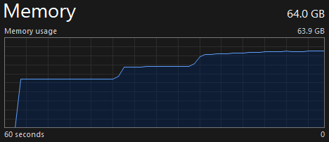

## Sand Devil

<p align="center"><a href="https://github.com/redskal/sand-devil"></a></p>

#### Overview

Automates the process of running a whois query against a known IP, identifying the address space of the AS the target IP belongs to, then performing reverse DNS against each IP in the address space, checking for the provided keywords. If it finds a match, it'll output it.

***Note: it supports IPv6, but you'll need to download a lot more RAM to use it due to the exponentially larger address space it has to generate individual IPs for. See screenshot below***

<p align="center"></p>

#### Usage

```bash
Usage of sand-devil:
  -keywords string
        Comma-separated list of keywords to search for
  -resolver string
        DNS server to use for lookups (default "1.1.1.1")
  -target string
        Target IP address to query for whois information.
  -threads int
        Number of threads to create (default 100)
```

#### Examples

Say we're looking at Microsoft. We need the IP of a known public-facing asset:

```bash
$ nslookup microsoft.com
...SNIP...
Non-authoritative answer:
Name:    microsoft.com
Addresses:  2603:1010:3:3::5b
          2603:1030:c02:8::14
          2603:1030:b:3::152
          2603:1020:201:10::10f
          2603:1030:20e:3::23c
          20.70.246.20
          20.76.201.171
          20.112.250.133
          20.231.239.246
          20.236.44.162
```

Then we supply the discovered IP and some keywords to Sand Devil:

```bash
$ ./sand-devil -target 20.70.246.20 -keywords "microsoft,office,azure" 
2025/01/25 03:38:36 Route CIDR found:       [20.33.0.0/16 20.34.0.0/15 20.36.0.0/14 20.40.0.0/13 20.48.0.0/12 20.64.0.0/10]
2025/01/25 03:38:37 Number of IPs to scan:  6225920
20.33.36.48     => ns-mx-megla.westeurope.cloudapp.azure.com.
20.33.39.3      => bcmx1.westeurope.cloudapp.azure.com.
20.33.40.70     => smtpapp4.northeurope.cloudapp.azure.com.
20.33.40.71     => smtpapp3.northeurope.cloudapp.azure.com.
20.33.40.135    => mail03.northeurope.cloudapp.azure.com.
20.33.49.53     => bcmx3.westeurope.cloudapp.azure.com.
20.33.66.101    => mailout3.westeurope.cloudapp.azure.com.
...SNIP...
```